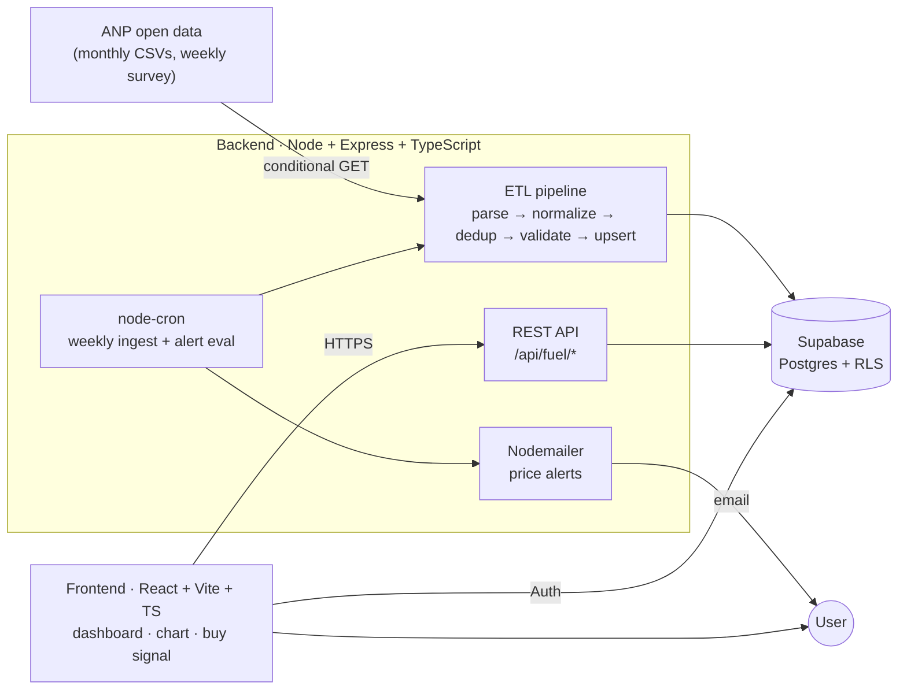

# ⛽ Price Tracker Pro

[](https://github.com/bernardobbl/price-tracker-pro/actions/workflows/ci.yml)
[](./LICENSE)


**Track real Brazilian fuel prices by city, decide whether it's a good time to fill up, and get an email when the price drops below your target — built on the [ANP open dataset](https://www.gov.br/anp/pt-br/centrais-de-conteudo/dados-abertos/serie-historica-de-precos-de-combustiveis).**

The core of the product — price history, trend, a 0–100 *buy signal*, station ranking and threshold alerts — runs on **public data that actually changes over time**: the ANP (Brazil's national petroleum agency) publishes a weekly survey of pump prices per city, station and brand. A weekly ETL job ingests it; users only read.

> ### 🇧🇷 Resumo (PT-BR)
> Rastreador de **preços reais de combustível por município**, a partir dos **dados abertos da ANP**. Mostra histórico, tendência, um **sinal de compra** ("bom momento de abastecer?"), o **ranking de postos mais baratos** (com link direto para o Google Maps) e **alertas por email** quando o preço médio cai abaixo de um valor. O coração do projeto é um **ETL idempotente** que ingere semanalmente o CSV público da ANP para o Supabase.

---

## 🔗 Demo

> **Deploy in progress** (see [Roadmap](#-roadmap)). Once live, **no login is needed to explore** —
> price lookup (fuel → state → city → chart, buy signal, station ranking) is public, like
> CamelCamelCamel/Keepa. Creating a free account is only required for favorites and email alerts.

<!-- Screenshots / GIF go here after deploy:


-->

---

## ✨ What it does

- **Explore** by fuel → state (UF) → city and see the municipal price series — **no account needed**.
- **Price intelligence**: current average, min/median/max, % change, **trend** (moving average), **volatility**, and a **buy signal** (0–100) that turns the chart into a *decision* ("fill up now" vs "wait").
- **"Where is it cheapest"**: ranking of the cheapest stations in the latest survey, each with a **"View on map"** link built from the station's real address (from the ANP data).
- **Alerts**: favorite a series and set a threshold; after each weekly ingestion, if the average falls to/below your target, you get an **email**. Because prices really move, the alert really fires.

## 🏗️ Architecture



**Data flow in one line:** a background job pulls the ANP CSVs → the ETL cleans and upserts them into `fuel_prices` (shared, read-only reference table) → the API serves aggregated series/snapshots → the dashboard renders the decision layer. **Writes happen once a week on the server; users only ever read.**

## ⚙️ How it works

1. A **weekly job** (or the `npm run ingest` CLI) downloads the ANP monthly CSVs (`gasolina-etanol`, `diesel-gnv`) with **conditional GET** (ETag / `If-Modified-Since`) and timeout/retry. Target months are **derived from the run date** (current month + 2 previous, year rollover handled), and the actual file URLs are **discovered from the year folder's listing page** rather than guessed from a template — ANP changed its file naming in 2026 (month prefix, one typo'd filename, one file without extension), so pattern-guessing is unreliable. A month missing from the listing simply isn't published yet and is skipped.
2. The **ETL** parses (header-driven, tolerant to accents/reordering), **normalizes** (canonical product names, digits-only CNPJ, plausible-price range), **deduplicates** by natural key `(cnpj, product, collected_at)`, passes a final **Zod** gate, and does an **idempotent upsert** into Supabase. Every run is recorded in `ingestion_runs` (rows read/inserted/rejected, hash, duration, status) for observability.
3. Anyone picks **fuel → UF → city** (public, no login), and the API returns the **daily series** (avg/min/max) **aggregated in Postgres** (SQL functions — immune to PostgREST's 1000-row response cap as history grows) plus the **latest-survey snapshot** with the station ranking.
4. Favorites + alerts require a free account (Supabase Auth) and are per-user (Row Level Security); the weekly job re-evaluates alerts after each ingestion and sends email via Nodemailer.

> A single real month (Dec/2025) ingests **~75k rows across all 27 states/DF with 0 rejected** — the pipeline is clean on production data.

## 🧰 Tech stack

| Layer | Choice |
|---|---|
| Frontend | React + Vite + TypeScript + Chart.js |
| Backend | Node.js + Express + TypeScript (strict) |
| ETL | Pure, testable functions (parse/normalize/dedup/validate) + `node-cron` |
| Database / Auth | Supabase (PostgreSQL + Row Level Security) |
| Validation | Zod (request schemas + ETL row gate) |
| Security | Helmet (security headers) + rate limiting on the public API |
| Email | Nodemailer (SMTP) |
| Tests | Vitest + Testing Library + supertest (**~125 tests**) |
| CI | GitHub Actions (lint · type-check · test · build) |

## 🚀 Run locally

**Prerequisites:** Node 20+ (`nvm use`), a [Supabase](https://supabase.com) project (URL + anon key + service_role key), optional SMTP for alert emails.

### 1. Database

In the Supabase **SQL Editor**, run `backend/supabase/schema.sql` (creates `fuel_prices`, `tracked_series`, `alerts`, `ingestion_runs`, the lookup functions and RLS). It's idempotent.

### 2. Backend

```bash
cd backend
cp .env.example .env      # fill SUPABASE_URL, SUPABASE_ANON_KEY, SUPABASE_SERVICE_ROLE_KEY
npm install
npm run ingest            # first load: ingests recent ANP months into Supabase
npm run dev               # API on http://localhost:4000
```

`npm run ingest` uses `ANP_YEAR` / `ANP_MONTHS` to build the file list (e.g. `ANP_MONTHS=10,11,12`). It skips files already ingested (content hash) and tolerates missing months (404 → skip).

### 3. Frontend

```bash
cd frontend
cp .env.example .env      # fill VITE_API_BASE_URL and VITE_SUPABASE_*
npm install
npm run dev               # dashboard on http://localhost:5173
```

### Demo data (optional)

`npm run seed` (in `backend/`) creates a demo user + one favorite/alert and ingests a **synthetic sample in the ANP layout** through the real ETL. Use it only for a quick offline demo — for real data, run `npm run ingest` instead. Set `VITE_DEMO_MODE=true` to show a "demo data" badge when the DB is seeded rather than real.

## ✅ Testing & CI

```bash
npm test        # in backend/ and frontend/
```

~125 tests cover the parser (real ANP fixtures), normalization/dedup, alert logic, request schemas, API routes (supertest), and the price-intelligence libs + chart component. GitHub Actions runs lint + type-check + test + build on every push/PR.

## 🧠 Technical decisions & trade-offs

- **Real public data over a scraping sandbox.** The project started scraping Mercado Livre (blocked + OAuth), moved to Books to Scrape (a static sandbox → *simulated* history), and finally to the **ANP open dataset** — real prices that move weekly. This fixed the product's core premise and turned the work into honest **data engineering** (ETL of large CSVs) rather than fragile HTML scraping.
- **Idempotent ETL.** Upsert on a natural key + content-hash skip + conditional GET means reprocessing the same file never duplicates data and rarely re-downloads it. Safe to run on any schedule.
- **Supabase as the single source of truth, with RLS.** `fuel_prices` is a *shared, read-only* reference table (public ANP data, written only by the service role); `tracked_series`/`alerts` are *per-user* with Row Level Security. No ephemeral local files.
- **Heavy work out of the request path.** Ingestion runs only in the cron job / CLI, never inside an HTTP request — the API stays fast and the scraping/ETL can't stall a user.
- **Hardened public API.** Helmet sets security headers and `express-rate-limit` caps per-IP request bursts, so exposing the API publicly doesn't invite trivial abuse; `npm audit` is clean (0 vulnerabilities).
- **Pure functions everywhere the logic lives.** Parsing, normalization, aggregation, buy-signal, trend and volatility are I/O-free and unit-tested, which is what makes the ~99 tests cheap and meaningful.
- **Monthly split files handled gracefully.** ANP ships monthly CSVs split by fuel group; the ingestor fans out over the list and skips any file that 404s, so a not-yet-published month never breaks the batch.
- **Discover, don't guess.** In 2026 ANP silently changed its file naming — including a typo'd filename and a file published without extension. The ingestor now scrapes the year folder's listing for the real hrefs (pure, fixture-tested parser) and falls back to the old naming pattern only if the listing is unreachable. Real-world government data is messy; the pipeline embraces that.
- **Built to run free, forever.** The weekly job only ever adds rows (~70k/month ≈ 22 MB/month, measured), which would eventually blow past Supabase's free-tier 500 MB. An automatic **retention policy** (`RETENTION_MONTHS`, default 12 — calibrated from real measurements to plateau at ~56% of the free tier) prunes surveys older than the window after each ingestion, so database size plateaus instead of growing — plus an `npm run db:stats` CLI to watch usage.

## 🗺️ Roadmap

- **Public deploy** (Vercel frontend + Render/Railway backend + Supabase) with a live demo login and real SMTP.
- **Screenshots + demo GIF** of the buy-signal flow.
- National (all-Brazil) aggregated series, reusing the same SQL-side aggregation approach.
- More historical months for richer trends; optional GLP (13 kg) support.

## 📚 Data source & legality (ANP)

Public **open government data**: the ANP *Série Histórica de Preços de Combustíveis*, from the agency's weekly price survey by municipality, product and reseller. Free to use **with attribution to ANP**; the `gov.br` `robots.txt` does not restrict the open-data path used. Collection is polite (one conditional download per week, timeout/retry) and idempotent (upsert on the natural key). This was the project's **2nd data-source migration** (Mercado Livre → Books to Scrape → ANP); the full history is in [`plan.md`](./plan.md).

## 📄 License

MIT — see [`LICENSE`](./LICENSE).
