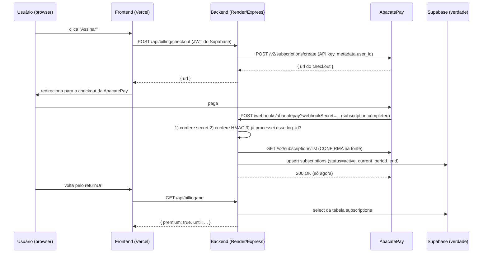

# Fase 10 — Arquitetura de pagamento (AbacatePay)

> **⚠️ Este arquivo só existe na branch `feat/premium-landing`.**
> A `main` sabe que este experimento existe (Fase 10 do `plan.md`), mas não carrega nenhuma linha dele.
> Nada aqui vai para a `main` sem o critério de sucesso da Fase 10.
>
> **Status:** 📋 PLANO, nada implementado. Escrito em 29/jul/2026.
> **Público-alvo deste documento:** você mesmo, daqui a 3 meses, sem lembrar de nada.

---

## 0. Antes de tudo: a regra que economiza meses

**Não construa cobrança agora.** Ela é a parte mais chata, mais arriscada e a única que envolve o
dinheiro de outra pessoa e a Receita Federal. A ordem correta é:

```
1. Landing /premium no ar  ──►  2. Alguém deixa email  ──►  3. Alguém PAGA na mão
                                                                     │
                                        (só depois desse ponto) ─────┘
                                                                     ▼
                              4. Automatizar (webhook, entitlement, gate)
```

O passo 3 se faz com **um link de pagamento** gerado no painel da AbacatePay e o acesso liberado
**por você, na mão, no banco**. Sim, na mão. Com 1 a 10 clientes isso leva 2 minutos por cliente e
te dá a única informação que importa: **alguém paga?** Automatizar antes disso é construir uma
esteira industrial para carregar uma caixa.

> **Critério para passar do 3 para o 4:** ~10 pagantes ou liberação manual virando incômodo real.
> Antes disso, automatizar é procrastinação disfarçada de engenharia.

---

## 1. Glossário (leia uma vez, o resto do documento fica fácil)

| Termo | Em português claro |
|---|---|
| **Gateway de pagamento** | A empresa que fala com os bancos por você. Aqui: AbacatePay. Você nunca toca em dinheiro nem em número de cartão. |
| **Checkout** | A página (dela, não sua) onde o cliente paga. Você manda o cliente para lá e ela te avisa depois. |
| **Webhook** | Um POST que a AbacatePay faz **no seu servidor** quando algo acontece ("pagou", "cancelou"). É ela ligando pra você, em vez de você ficar perguntando. |
| **Entitlement** (direito de acesso) | O registro **no seu banco** que diz "este usuário é premium até tal data". É isso que o app consulta — nunca o gateway. |
| **Idempotência** | Processar o mesmo evento duas vezes sem estragar nada. Webhook repete: se você não tratar, o cliente ganha 2 meses de acesso por 1 pagamento. |
| **HMAC / assinatura** | Uma "impressão digital" do corpo da requisição, calculada com uma chave. Serve para saber se o conteúdo não foi alterado no caminho. |
| **Sandbox / devMode** | Ambiente de mentira. Você simula pagamentos sem dinheiro real. Onde 90% deste plano deve ser construído. |
| **Gate / feature flag** | O `if` que decide se o usuário vê a funcionalidade paga. |
| **Churn** | Gente que cancela. Em assinatura barata, é o que mata. |
| **MRR** | Receita recorrente mensal. A métrica que o vitalício destruía. |
| **Chargeback / disputa** | Cliente contesta a cobrança no cartão. Você perde o dinheiro e leva taxa. |
| **Dunning** | O processo de cobrar de novo quando o pagamento falha (cartão expirado, sem saldo). |

---

## 2. O que a AbacatePay é — e o que ela **não** é

**Fatos apurados na documentação oficial (29/jul/2026):**

- API REST + JSON, base `https://api.abacatepay.com/v2`, autenticação `Authorization: Bearer <api-key>`.
- **Valores em centavos.** `690` = R$ 6,90. Errar isso cobra R$ 690,00 de alguém. Escreva um helper e um teste.
- Respostas vêm num envelope: `{ "data": {...}, "success": true, "error": null }`.
- **Assinatura exige um "produto" com `cycle`** (`WEEKLY`, `MONTHLY`, `SEMIANNUALLY`, `ANNUALLY`),
  criado antes via `POST /products/create`. O checkout de assinatura aceita **exatamente 1 item**.
- Endpoints que interessam: `POST /products/create`, `POST /subscriptions/create`,
  `POST /subscriptions/cancel`, `GET /subscriptions/list`, `POST /webhooks/create`,
  `POST /transparents/create` (Pix avulso com QR embutido no seu site), `GET /transparents/check`.
- Eventos de webhook: `subscription.completed`, `subscription.renewed`, `subscription.cancelled`,
  `checkout.completed`, `checkout.refunded`, `checkout.disputed`, `transparent.completed`, etc.
- Payload padrão: `{ id: "log_...", event: "...", apiVersion: 2, devMode: false, data: {...} }`.
- Existe **devMode** (ambiente de teste) e `POST /transparents/simulate-payment` para simular pagamento.
- `taxId` (CPF) vem **mascarado** nos webhooks. Cartão: só bandeira e 4 últimos dígitos.

**O que ela não é / cuidados:**

1. **Assinatura recorrente é, por padrão, CARTÃO** (`methods` default `["CARD"]`). O Pix "recorrente"
   depende do Pix Automático, que exige suporte do banco do cliente e adesão dele. Ou seja:
   **não prometa "assinatura no Pix" como se fosse igual a cartão.** Para Pix, o que funciona sem
   fricção é **cobrança avulsa** — o que casa perfeitamente com o **plano anual de R$ 60**.
2. **Ela não emite nota fiscal** e não resolve seu ISS. Ver seção 7.
3. **Ela não é seu banco de dados.** Se você depender de consultar a API para saber quem é premium,
   um incidente dela derruba o seu app. O direito de acesso mora no seu Supabase.
4. **A "chave pública HMAC" do exemplo da doc é pública** — está impressa na documentação. Isso
   significa que o HMAC comprova **integridade** (o corpo não mudou), **não autenticidade**
   (qualquer um que leu a doc consegue assinar um corpo falso). Consequência prática: **a assinatura
   HMAC sozinha não é autenticação.** Ver seção 6, item 2 — o desenho aqui usa 3 camadas por isso.

---

## 3. A conta que decide o desenho (seja frio aqui)

**Taxas informadas pela AbacatePay** (cobrança recorrente): **Pix R$ 0,80 por parcela**;
**cartão 3,5% + R$ 0,60 por parcela**. Saque: **R$ 0,80** por saque, mínimo R$ 3,50.
_Confirme os números atuais na página de preços antes de implementar — taxa muda._

| Plano | Bruto | Taxa | Líquido | Taxa como % |
|---|---|---|---|---|
| Mensal, cartão | R$ 6,90 | R$ 0,84 | **R$ 6,06** | **12,2%** 🚨 |
| Mensal, Pix | R$ 6,90 | R$ 0,80 | R$ 6,10 | 11,6% 🚨 |
| **Anual, Pix** | R$ 60,00 | R$ 0,80 | **R$ 59,20** | **1,3%** ✅ |
| Anual, cartão | R$ 60,00 | R$ 2,70 | R$ 57,30 | 4,5% ✅ |

**Leitura honesta:** taxa fixa por transação destrói ticket baixo. No mensal você entrega o serviço
o ano todo e perde **1 mês e meio de receita** só em taxa — e ainda paga taxa 12 vezes em vez de 1.

> **Recomendação:** venda o **anual (R$ 60, Pix) como plano principal** e trate o mensal (R$ 6,90,
> cartão) como opção secundária, para quem não quer compromisso. Isso não muda seu preço nem sua
> promessa — muda só o que a página destaca. E resolve de graça o problema do Pix recorrente.

**Custo do outro lado (o que você paga hoje):** infra R$ 0 (free tier, com retenção de 12 meses
garantindo o platô — Fase 9). Mas a landing promete **WhatsApp**, e WhatsApp Business API é
**custo por mensagem + aprovação de template pela Meta**. Ou seja: a única promessa da página que
tem custo variável é justamente a mais chamativa. Ver seção 8.

**Ponto de equilíbrio, se você formalizar (MEI):** o DAS do MEI é da ordem de ~R$ 75–80/mês
(_confirme o valor de 2026_). Com R$ 6,06 líquidos por assinante mensal, **você precisa de ~13
assinantes só para pagar o imposto** — antes de sobrar 1 real. Com o anual: ~16 assinantes/ano.
Este número é o teto de realidade do projeto: ele não é "renda", é validação de produto.

---

## 4. A arquitetura em uma frase

> **O gateway avisa. O seu banco decide. O app pergunta ao seu banco.**

Três camadas, cada uma com uma responsabilidade só:



**O erro clássico que este desenho evita:** liberar o acesso quando o navegador volta pela
`returnUrl`. A `returnUrl` é uma URL que **qualquer pessoa pode digitar**. Acesso se libera **só**
no fluxo servidor↔servidor (webhook + confirmação na API).

---

## 5. Modelo de dados (Supabase) — proposta de SQL

Segue o estilo do `backend/supabase/schema.sql`: tabelas com RLS, leitura só do próprio dono,
escrita **exclusiva** do `service_role` (o backend). O usuário nunca pode escrever no seu próprio
direito de acesso — senão dá pra virar premium com um `curl`.

```sql
-- ─────────────────────────────────────────────────────────────────────────────
-- FASE 10 (EXPERIMENTO) — assinaturas. NÃO aplicar em produção antes da Etapa 2.
-- ─────────────────────────────────────────────────────────────────────────────

create table if not exists public.subscriptions (
  id                   uuid primary key default gen_random_uuid(),
  user_id              uuid not null unique references auth.users (id) on delete cascade,
  plan                 text not null check (plan in ('monthly','annual')),
  status               text not null check (status in ('active','canceled','past_due','expired')),
  -- até quando o acesso vale. É ISTO que o app consulta.
  current_period_end   timestamptz not null,
  -- rastreabilidade com o gateway (nunca é a fonte da verdade, só referência)
  provider             text not null default 'abacatepay',
  provider_sub_id      text,
  provider_customer_id text,
  dev_mode             boolean not null default false,
  created_at           timestamptz not null default now(),
  updated_at           timestamptz not null default now()
);

create index if not exists subscriptions_period_idx
  on public.subscriptions (status, current_period_end desc);

-- Livro-caixa de eventos: garante idempotência e dá auditoria quando algo der errado.
create table if not exists public.billing_events (
  id            uuid primary key default gen_random_uuid(),
  provider      text not null default 'abacatepay',
  event_id      text not null,          -- o "log_abc123" do payload
  event_type    text not null,          -- subscription.completed, etc.
  dev_mode      boolean not null default false,
  user_id       uuid references auth.users (id) on delete set null,
  payload       jsonb not null,
  processed_at  timestamptz,
  created_at    timestamptz not null default now(),
  constraint billing_events_unique unique (provider, event_id)  -- ← a idempotência vive aqui
);

alter table public.subscriptions  enable row level security;
alter table public.billing_events enable row level security;

-- Usuário lê a própria assinatura. E só isso.
create policy subscriptions_select_own on public.subscriptions
  for select using (auth.uid() = user_id);
-- Nenhuma policy de insert/update/delete para authenticated: só o service_role escreve
-- (o service_role ignora RLS por definição).

-- billing_events: nenhuma policy. Ninguém além do backend enxerga.

-- Função única de verdade do acesso — usada pelo backend e reutilizável em policies futuras.
create or replace function public.is_premium(p_user_id uuid)
returns boolean
language sql
stable
as $$
  select exists (
    select 1 from public.subscriptions s
     where s.user_id = p_user_id
       and s.status in ('active','canceled')   -- 'canceled' ainda vale até o fim do período pago
       and s.current_period_end > now()
  );
$$;

revoke execute on function public.is_premium(uuid) from public, anon;
grant   execute on function public.is_premium(uuid) to authenticated, service_role;
```

**Duas decisões escondidas aí, de propósito:**

1. `status='canceled'` **continua premium** até `current_period_end`. Quem cancelou pagou o mês.
   Cortar na hora do cancelamento é o tipo de detalhe que gera reclamação e chargeback.
2. Não existe coluna `is_premium boolean`. Booleano não expira; data expira. Um booleano vira
   premium eterno no dia em que um webhook de expiração se perder.

---

## 6. O que muda no backend (contratos, não código)

Arquivos novos — todos isolados, nada de mexer em serviço existente:

```
backend/src/routes/billingRoute.ts          # rotas autenticadas do cliente
backend/src/routes/webhookRoute.ts          # o endpoint que a AbacatePay chama
backend/src/services/abacatePayClient.ts    # a única coisa que fala HTTP com a AbacatePay
backend/src/services/subscriptionService.ts # escreve/lê o entitlement no Supabase
backend/src/middleware/requirePremium.ts    # o "gate"
backend/src/lib/webhookVerify.ts            # secret + HMAC (função pura → testável)
backend/src/lib/money.ts                    # reais ⇄ centavos, com teste
backend/test/webhook.test.ts
backend/test/subscription.test.ts
```

### Endpoints

| Método | Rota | Auth | O que faz |
|---|---|---|---|
| POST | `/api/billing/checkout` | JWT Supabase | Cria o checkout na AbacatePay com `metadata.user_id` e devolve a `url`. Não confia em preço vindo do front — o plano é `'monthly' \| 'annual'` e o preço mora no backend. |
| GET | `/api/billing/me` | JWT Supabase | `{ premium: boolean, plan, until, status }` lido do Supabase. |
| POST | `/api/billing/cancel` | JWT Supabase | Chama `POST /subscriptions/cancel` e marca `status='canceled'` mantendo o período pago. |
| POST | `/webhooks/abacatepay` | **secret + HMAC** | Recebe os eventos. **Fora de `/api`** (ver abaixo). |

### Cinco detalhes de implementação que quebram na prática (e a maioria dos tutoriais ignora)

1. **O webhook precisa do corpo cru (raw body).** `app.use(express.json())` consome o stream e o
   HMAC passa a ser calculado sobre um JSON re-serializado — que não é byte-a-byte igual ao que foi
   assinado. A verificação falha "sem motivo". Solução: montar a rota do webhook com
   `express.raw({ type: 'application/json' })` **antes** do `express.json()` global no `app.ts`.
2. **Assinatura HMAC não é autenticação aqui.** A chave do exemplo oficial é pública. Portanto o
   endpoint usa **três camadas**, na ordem:
   `(a)` `req.query.webhookSecret === process.env.ABACATEPAY_WEBHOOK_SECRET` (comparação
   `timingSafeEqual`); `(b)` HMAC-SHA256 do corpo cru; `(c)` **reconsulta na API da AbacatePay**
   (`GET /subscriptions/list` ou `/checkouts/one`) antes de liberar qualquer coisa. Só a camada (c)
   é prova real de pagamento. **Fail-closed:** se (c) falhar ou for inconclusiva, registre o evento,
   **não libere**, e responda 200 (para não entrar em loop de retentativa) com o evento pendente para
   reprocessamento manual.
3. **O webhook não pode ficar atrás do rate limiter.** Hoje o `apiLimiter` cobre todo `/api`
   (300 req/15min por IP). Uma rajada de retentativas da AbacatePay tomaria 429, e um 429 é
   interpretado como falha → mais retentativa. Por isso a rota fica em `/webhooks/...`, fora de
   `/api`, com um limiter próprio bem folgado. **CORS não se aplica** (não é browser).
4. **Idempotência de verdade:** `insert into billing_events` com `unique (provider, event_id)`
   **antes** de processar. Violação de unicidade = evento repetido → responde 200 e não faz nada.
   É o banco garantindo, não um `if` na memória do processo (que morre a cada deploy do Render).
5. **`devMode`:** eventos de teste chegam com `devMode: true`. Em produção, **ignore-os**
   (grave e responda 200). Sem essa checagem, qualquer um que descubra a URL e o secret vira premium
   simulando um pagamento no ambiente de teste.

Bônus: **não valide o payload inteiro com Zod** (a própria doc recomenda isso). Valide só os 4–5
campos que você usa; assim um campo novo na AbacatePay não derruba seu endpoint às 3 da manhã.

### O "cold start" do Render é um problema aqui

O backend dorme no free tier. Um webhook que chega num serviço dormindo pode dar timeout na primeira
tentativa. A AbacatePay reenvia, então **funciona** — mas só porque existe idempotência. Mais um
motivo para o item 4 não ser opcional. O keep-alive de 3 dias (Fase 6.95) ajuda, não resolve.

---

## 7. Fiscal e jurídico — a parte que realmente travaria você

Isto não é conselho jurídico ou contábil; é o mapa do que perguntar a um contador antes de aceitar
o primeiro real.

- **Receber dinheiro recorrente de terceiros pede CNPJ.** Cair na conta pessoal (PF) gera
  movimentação sem lastro e é dor de cabeça futura. MEI resolve barato, mas tem custo mensal fixo
  (DAS) que, como mostrou a seção 3, exige ~13 assinantes só para empatar.
- **Nota fiscal de serviço** é obrigação municipal (ISS). O gateway não emite por você.
- **Direito de arrependimento:** compra online no Brasil tem 7 dias (CDC art. 49). Sua política de
  reembolso precisa existir por escrito **antes** da primeira venda, e o fluxo de estorno
  (`checkout.refunded`) precisa desligar o acesso.
- **Termos de Uso + Política de Privacidade** obrigatórios a partir do momento em que você cobra.
- **LGPD:** e-mail é dado pessoal. Base legal, opt-in explícito na captura da landing, e um jeito de
  a pessoa pedir exclusão. A landing já tem a captura — a política precisa nascer junto.
- **Dados de terceiros:** os preços são dados abertos da ANP, o que é ótimo. Mas revenda de dado
  público exige checar a licença de uso da fonte antes de cobrar por cima dela. Confirme.

### 🎯 O caminho que eu recomendo para o seu objetivo declarado

Seu objetivo é **portfólio e LinkedIn**, e o projeto já está pronto para isso. Então:

> **Implemente a arquitetura completa em `devMode` (sandbox) e pare ali.**

Você ganha 100% do crédito técnico — webhook assinado, idempotência, entitlement com RLS,
gate de feature, testes de borda — com **0% do risco fiscal, jurídico e de suporte**. No README
você escreve, com orgulho e honestidade:

> "Fluxo de assinatura implementado ponta a ponta contra o sandbox da AbacatePay (webhook com
> verificação HMAC, idempotência por `event_id`, entitlement com expiração e RLS). Cobrança real
> não está habilitada por decisão de escopo."

Isso é **mais impressionante** que um Pix funcionando, porque mostra que você entende os modos de
falha. E te deixa livre para ligar o dinheiro real no dia em que houver demanda comprovada.

---

## 8. Buracos na promessa da landing (achados ao revisar o produto)

Achados críticos ao comparar o que a página vende com o que o app faz **hoje**:

| A landing promete | Realidade no código | O que fazer |
|---|---|---|
| "Alertas que valem dinheiro" | **Alertas já existem e são grátis** (tabela `alerts`, `fuelAlertService`, sem nenhum limite por plano). | Você não pode vender o que já deu. Ou o grátis passa a ter **limite** (ex.: 1 alerta) e quem já usa é **grandfathered** (mantém o que tem), ou o Premium vende outra coisa (mais séries, mais frequência, WhatsApp). |
| "Chega no WhatsApp" | Não existe. WhatsApp Business API custa por mensagem e exige aprovação de template pela Meta. | É a promessa mais caríssima da página. Rotule como **"em breve"** ou troque por e-mail, que já funciona. Prometer e não entregar em produto pago = chargeback. |
| "Histórico completo" | A retenção é de **12 meses** por decisão da Fase 9 (custo zero). | Diga "12 meses de histórico". Preciso é melhor que "completo". |
| "Cancela em 1 clique" | Precisa do `POST /subscriptions/cancel` + tela. | Ou implementa, ou muda para "cancele respondendo um e-mail". Não anuncie botão que não existe. |

**Retirar funcionalidade que hoje é grátis é o risco número um deste experimento.** Um usuário que
perde o que já tinha reclama muito mais alto do que um novo que nunca teve. Regra: **o gate só se
aplica a contas criadas depois da data de corte.**

---

## 9. Plano de execução — 5 etapas, cada uma com um portão

Nenhuma etapa começa sem o portão da anterior. Se um portão não abre, **o experimento morre ali** e
a branch é apagada. Isso não é fracasso; é o teste funcionando.

### Etapa 0 — Porta falsa (✅ já feita nesta branch)
Landing `/premium` com preço, captura de e-mail e analytics de funil.
**Portão:** ≥ 30 e-mails **ou** 1 pagamento manual em 2–4 semanas.

### Etapa 1 — Cobrança manual (0 linhas de backend)
Link de pagamento criado no painel da AbacatePay. Você libera o acesso na mão, no Supabase.
**DoD:** primeiro real recebido; texto de boas-vindas escrito; política de reembolso publicada.
**Portão:** liberar na mão virou incômodo (≈10 clientes).

### Etapa 2 — Assinatura ponta a ponta, **em devMode** (o coração técnico)
Migration das tabelas da seção 5 + `abacatePayClient` + `webhookRoute` com as 3 camadas +
idempotência + `subscriptionService` + `GET /api/billing/me` + testes da seção 10.
Nada de tela de pagamento real; use `POST /transparents/simulate-payment` e webhooks de devMode.
**DoD:** `npm test` verde, CI verde, um pagamento simulado virando `subscriptions.status='active'`
e um evento repetido **não** dobrando o período. README atualizado com a nota de escopo da seção 7.
**Portão:** você consegue explicar o fluxo inteiro em voz alta, sem olhar o código.

### Etapa 3 — Gate de feature (com carinho)
`requirePremium` + limite no plano grátis + data de corte que preserva usuários atuais + estado de
UI ("você atingiu o limite do plano grátis") sem tela quebrada.
**DoD:** teste provando que conta antiga não perde nada e conta nova bate no limite.
**Portão:** só siga para a Etapa 4 se a Etapa 1 já tiver clientes pagando de verdade.

### Etapa 4 — Dinheiro real (só com a casa em ordem)
CNPJ/MEI, termos, privacidade, reembolso, nota fiscal, chaves de produção no Render (**nunca** no
front), webhook de produção cadastrado, `devMode` bloqueado em produção.
**DoD:** um pagamento real, de outra pessoa, liberando acesso sozinho, com log auditável.

### Etapa 5 — Operação (o que ninguém planeja e todo mundo sofre)
Estorno/disputa desligando acesso; cobrança que falhou (dunning); e-mail de "seu cartão expirou";
relatório mensal de MRR/churn; runbook de "cliente pagou e não liberou" — que **vai** acontecer.

---

## 10. Testes que provam que isso não vai te dar prejuízo

Vocês já têm Vitest + supertest, então isso é barato:

- [ ] `money`: `690` centavos ⇄ `R$ 6,90`, ida e volta, incluindo arredondamento.
- [ ] Webhook **sem** `webhookSecret` → 401 e **nada** escrito no banco.
- [ ] Webhook com secret certo e **HMAC errado** → 401.
- [ ] Webhook válido `subscription.completed` → cria `subscriptions` com `current_period_end` futuro.
- [ ] **Mesmo `event_id` duas vezes** → segunda vez não altera `current_period_end` (o teste mais
      importante da lista).
- [ ] `devMode: true` com `NODE_ENV=production` → registra e **não** libera acesso.
- [ ] `subscription.cancelled` → `status='canceled'` e acesso **mantido** até o fim do período.
- [ ] `checkout.refunded` → acesso desligado imediatamente.
- [ ] `is_premium` com `current_period_end` no passado → `false`.
- [ ] `requirePremium` → 402/403 para não-assinante, passa para assinante.
- [ ] RLS: usuário A **não** lê a `subscriptions` do usuário B; `authenticated` **não** consegue
      dar `insert` na própria assinatura.

---

## 11. Anti-padrões — a lista do "não faça"

1. ❌ Liberar acesso na `returnUrl`/`completionUrl`. É um GET que qualquer um digita.
2. ❌ Guardar a chave da API no frontend, no `vercel.json` ou em qualquer `VITE_*`. Tudo que tem
   prefixo `VITE_` **vai para o navegador**.
3. ❌ Perguntar à API da AbacatePay "esse usuário é premium?" em cada request. Lento, frágil e cai
   quando ela cair.
4. ❌ Coluna `is_premium boolean`. Use data de expiração.
5. ❌ Preço no frontend como fonte da verdade. O front manda `plan`, o backend decide o valor.
6. ❌ Responder 200 antes de processar (perde eventos) — ou nunca responder 200 (retentativa infinita).
7. ❌ `console.log` do payload inteiro em produção (dado pessoal, LGPD).
8. ❌ Construir WhatsApp, área de admin ou cupons antes de ter 10 pagantes.
9. ❌ Fazer merge desta branch na `main` "só para não perder o trabalho". O trabalho está no git;
   a branch é o lugar dele.
10. ❌ Tirar do plano grátis algo que os usuários atuais já usam.

---

## 12. Variáveis de ambiente (todas no backend, nenhuma no front)

```bash
# backend/.env  (e no painel do Render — nunca no repositório)
ABACATEPAY_API_KEY=            # secreta. Rotacione se vazar.
ABACATEPAY_WEBHOOK_SECRET=     # o segredo que vai na query string do webhook
ABACATEPAY_PRODUCT_MONTHLY=    # id do produto cycle=MONTHLY  (R$ 6,90 = 690)
ABACATEPAY_PRODUCT_ANNUAL=     # id do produto cycle=ANNUALLY (R$ 60,00 = 6000)
ABACATEPAY_DEV_MODE=true       # true até a Etapa 4
BILLING_ENABLED=false          # kill switch: desliga as rotas sem redeploy de código
```

`BILLING_ENABLED=false` por padrão significa que, mesmo se esta branch entrar na `main` por
acidente, **nada de cobrança liga em produção**. É o cinto de segurança do experimento.

---

## 13. Arquivos que este experimento adiciona (isolamento)

```
docs/fase10-pagamentos.md          ← este arquivo
frontend/public/premium.html        ← a landing (Etapa 0)
frontend/vercel.json                ← +1 rewrite para /premium
                                    ── daqui pra baixo, só a partir da Etapa 2 ──
backend/supabase/migrations/010_subscriptions.sql
backend/src/routes/billingRoute.ts
backend/src/routes/webhookRoute.ts
backend/src/services/abacatePayClient.ts
backend/src/services/subscriptionService.ts
backend/src/middleware/requirePremium.ts
backend/src/lib/webhookVerify.ts
backend/src/lib/money.ts
backend/test/webhook.test.ts
backend/test/subscription.test.ts
```

**Nenhum arquivo existente é reescrito**, com duas exceções inevitáveis na Etapa 2
(`backend/src/app.ts` para montar as rotas + o raw body, e `schema.sql`). Essas duas são o único
ponto de contato com o código de produção — trate-as com o cuidado de um PR de verdade.

---

**Fontes consultadas (29/jul/2026):** documentação oficial da AbacatePay — índice `llms.txt`,
página de Webhooks (verificação HMAC, eventos, boas práticas), referência de Assinaturas
(ciclos, `methods` default `["CARD"]`) e a página de cobrança recorrente (taxas).
